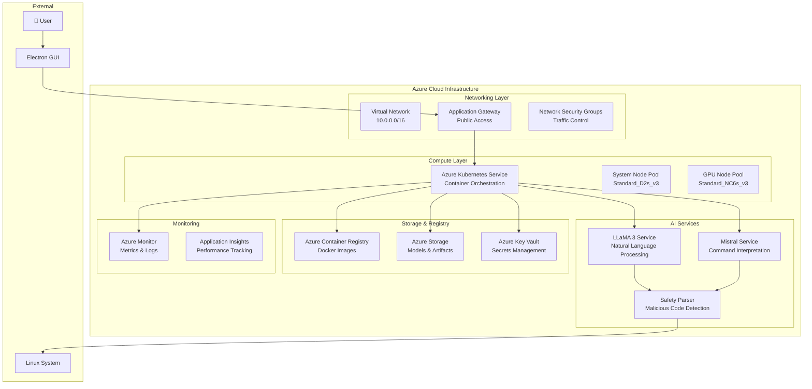

# Brian AI Assistant - Azure Infrastructure


[](https://terraform.io/)
[](https://azure.microsoft.com/)
[](https://kubernetes.io/)

> **Enterprise-grade Azure infrastructure for Brian AI Assistant v2.0** - A Linux-native AI assistant with full offline capability using LLaMA 3 and Mistral models via Ollama, featuring hotkey-activated GUI and advanced safety parsing.

## 🚀 Project Overview

Brian AI Assistant is a sophisticated AI system designed to interpret system-level tasks in natural language with >95% command execution accuracy. This repository contains the complete Azure infrastructure as code (IaC) using Terraform, enabling scalable, secure, and cost-effective deployment.

### 🎯 Key Features

- **🧠 Dual AI Models**: LLaMA 3 & Mistral via Ollama for enhanced accuracy
- **⚡ High Performance**: >95% command execution accuracy
- **🛡️ Enhanced Security**: Safety parsing blocking malformed/harmful instructions (40% reliability improvement)
- **🎮 Intuitive Interface**: Hotkey-activated Electron GUI
- **📱 Full Offline Capability**: No internet dependency required
- **🔧 System Integration**: Direct Linux system-level task execution
- **📊 Enterprise Monitoring**: Comprehensive logging and metrics

## 🏗️ Architecture Overview



## 📋 Prerequisites

- **Azure Subscription** with sufficient permissions
- **Terraform** >= 1.6.0
- **Azure CLI** >= 2.50.0
- **kubectl** >= 1.28.0
- **Docker** >= 24.0.0 (for local testing)
- **Git** for version control

## 🚀 Quick Start

### 1. Clone Repository
```bash
git clone https://github.com/sat0ps/terraform-azure-brian.git
cd terraform-azure-brian
```

### 2. Configure Azure Authentication
```bash
# Login to Azure
az login

# Set subscription (replace with your subscription ID)
az account set --subscription "your-subscription-id"

# Create service principal for Terraform
az ad sp create-for-rbac --name "brian-ai-terraform" --role="Contributor" --scopes="/subscriptions/your-subscription-id"
```

### 3. Setup Terraform Backend
```bash
# Create storage account for Terraform state
az group create --name rg-terraform-state --location "East US 2"
az storage account create --name tfstatebrianai001 --resource-group rg-terraform-state --location "East US 2" --sku Standard_LRS
az storage container create --name tfstate --account-name tfstatebrianai001
```

### 4. Configure Environment Variables
```bash
# Copy example environment file
cp environments/dev.tfvars.example environments/dev.tfvars

# Edit variables according to your requirements
nano environments/dev.tfvars
```

### 5. Initialize and Deploy
```bash
# Initialize Terraform
terraform init \
  -backend-config="storage_account_name=tfstatebrianai001" \
  -backend-config="container_name=tfstate" \
  -backend-config="key=brian-ai-dev.tfstate" \
  -backend-config="resource_group_name=rg-terraform-state"

# Plan deployment
terraform plan -var-file="environments/dev.tfvars"

# Apply infrastructure
terraform apply -var-file="environments/dev.tfvars"
```

### 6. Connect to AKS Cluster
```bash
# Get AKS credentials
az aks get-credentials --resource-group $(terraform output -raw resource_group_name) --name $(terraform output -raw aks_cluster_name)

# Verify connection
kubectl get nodes
kubectl get pods -n brian-ai
```

## 🔧 Configuration

### Environment Variables

| Variable | Description | Default | Required |
|----------|-------------|---------|----------|
| `resource_group_name` | Resource group name | `rg-brian-ai` | No |
| `location` | Azure region | `East US 2` | No |
| `environment` | Environment (dev/staging/prod) | `dev` | No |
| `aks_cluster_name` | AKS cluster name | `aks-brian-ai` | No |
| `acr_name` | Container registry name | `acrbrianaiunique001` | Yes* |
| `storage_account_name` | Storage account name | `brianaistorage001` | Yes* |

*Must be globally unique

### Node Pool Configuration

```hcl
node_pools = {
  system = {
    vm_size             = "Standard_D2s_v3"
    node_count          = 2
    min_count           = 1
    max_count           = 5
    enable_auto_scaling = true
  }
  ai_workload = {
    vm_size             = "Standard_NC6s_v3"  # GPU-enabled
    node_count          = 1
    min_count           = 0
    max_count           = 3
    enable_auto_scaling = true
    node_taints         = ["nvidia.com/gpu=true:NoSchedule"]
  }
}
```

### AI Model Configuration

```hcl
ai_model_config = {
  llama3_image_tag     = "latest"
  mistral_image_tag    = "latest"
  replica_count        = 2
  safety_parsing_enabled = true
  resource_limits = {
    cpu    = "2000m"
    memory = "8Gi"
    gpu    = "1"
  }
}
```

## 🔐 Security Features

### Network Security
- **Network Security Groups (NSGs)** with restrictive rules
- **Private networking** for internal communication
- **Application Gateway** with WAF capabilities
- **Virtual Network** isolation

### Identity & Access Management
- **Azure AD integration** for authentication
- **RBAC** for granular permissions
- **User Assigned Identities** for secure service communication
- **Key Vault** for secrets management

### Safety Parsing
- **Input validation** and sanitization
- **Command pattern blocking** for dangerous operations
- **Rate limiting** and request throttling
- **Audit logging** for all operations

## 📊 Monitoring & Observability

### Metrics Collected
- **System Performance**: CPU, Memory, GPU utilization
- **API Metrics**: Request rate, response time, error rate
- **Model Performance**: Inference time, accuracy metrics
- **Security Events**: Blocked requests, safety parsing triggers

### Dashboards Available
- **Infrastructure Overview**: Resource utilization
- **Brian AI Performance**: AI model metrics
- **Security Dashboard**: Threat detection and blocked requests
- **Cost Management**: Resource costs and optimization

### Alerting Rules
- **High resource utilization** (>80% CPU/Memory)
- **API error rate** exceeding threshold
- **Security incidents** detected
- **Service unavailability**

## 💰 Cost Optimization

### Estimated Monthly Costs (USD)

| Component | Cost Range | Notes |
|-----------|------------|-------|
| AKS Cluster | $200-500 | Depends on node count |
| GPU Nodes (NC6s_v3) | $800-1200 per node | For AI inference |
| Storage Account | $20-50 | Model storage and artifacts |
| Container Registry | $20 | Premium SKU |
| Application Gateway | $200 | Standard v2 SKU |
| Key Vault | $5 | Secrets management |
| Monitoring | $50-100 | Logs and metrics |
| **Total** | **$1,295-2,075** | Variable based on usage |

### Cost Optimization Strategies
- **Auto-scaling**: Automatically scale down during low usage
- **Spot Instances**: Use spot VMs for non-critical workloads
- **Reserved Instances**: Commit to 1-3 year terms for discounts
- **Resource Tagging**: Track costs by team/project
- **Monitoring**: Set up cost alerts and budgets

## 🔄 CI/CD Pipeline

The project includes a comprehensive GitHub Actions workflow:

### Pipeline Stages
1. **Terraform Validation**: Format, validate, and plan
2. **Infrastructure Deployment**: Apply Terraform changes
3. **Docker Build & Push**: Build and push container images
4. **Kubernetes Deployment**: Deploy to AKS cluster
5. **Health Checks**: Verify deployment success

### Branch Strategy
- **`main`** → Production deployment
- **`develop`** → Staging deployment  
- **Feature branches** → Development environment

### Secrets Required
```yaml
AZURE_SUBSCRIPTION_ID
AZURE_TENANT_ID
AZURE_CLIENT_ID
AZURE_CLIENT_SECRET
AZURE_CREDENTIALS  # JSON format
TFSTATE_STORAGE_ACCOUNT
TFSTATE_RESOURCE_GROUP
```

## 🚦 API Usage

### Health Check Endpoint
```bash
curl -X GET "https://your-app-gateway-ip/health"
```

### Execute Command
```bash
curl -X POST "https://your-app-gateway-ip/api/v1/execute" \
  -H "Content-Type: application/json" \
  -d '{
    "query": "list all running processes",
    "model": "llama3",
    "safety_check": true
  }'
```

### Response Format
```json
{
  "status": "success",
  "command": "ps aux",
  "output": "process list...",
  "safety_check": "passed",
  "execution_time": 0.145,
  "model_used": "llama3"
}
```

## 🏷️ Module Structure

```
terraform-azure-brian/
├── main.tf                          # Main Terraform configuration
├── variables.tf                     # Input variables
├── outputs.tf                       # Output values
├── environments/                    # Environment-specific configs
│   ├── dev.tfvars
│   ├── staging.tfvars
│   └── prod.tfvars
├── modules/                         # Reusable Terraform modules
│   ├── networking/                  # VNet, subnets, NSGs
│   ├── aks/                        # Kubernetes cluster
│   ├── container-registry/         # Azure Container Registry
│   ├── storage/                    # Storage accounts, file shares
│   ├── security/                   # Key Vault, RBAC
│   ├── monitoring/                 # Log Analytics, App Insights
│   ├── ml-services/               # Machine Learning workspace
│   └── application-gateway/       # Application Gateway
├── k8s/                            # Kubernetes manifests
├── docker/                         # Docker configurations
├── .github/workflows/             # CI/CD pipelines
└── docs/                          # Additional documentation
```

## 🤝 Contributing

1. **Fork** the repository
2. Create a **feature branch** (`git checkout -b feature/amazing-feature`)
3. **Commit** your changes (`git commit -m 'Add amazing feature'`)
4. **Push** to the branch (`git push origin feature/amazing-feature`)
5. Open a **Pull Request**

### Development Guidelines
- Follow Terraform best practices
- Include comprehensive documentation
- Add tests for new features
- Update README for significant changes

## 📚 Additional Resources

- **[Terraform Azure Provider Documentation](https://registry.terraform.io/providers/hashicorp/azurerm/latest/docs)**
- **[Azure Kubernetes Service Documentation](https://docs.microsoft.com/en-us/azure/aks/)**
- **[Ollama Documentation](https://ollama.ai/docs)**
- **[LLaMA 3 Model Information](https://huggingface.co/meta-llama/Meta-Llama-3-8B)**

## 📄 License

This project is licensed under the MIT License - see the [LICENSE](LICENSE) file for details.

## 🆘 Support

- **Issues**: [GitHub Issues](https://github.com/sat0ps/terraform-azure-brian/issues)
- **Discussions**: [GitHub Discussions](https://github.com/sat0ps/terraform-azure-brian/discussions)
- **Email**: support@brian-ai.dev

## 🏆 Acknowledgments

- **Meta AI** for the LLaMA 3 model
- **Mistral AI** for the Mistral model  
- **Ollama** for the local AI runtime
- **HashiCorp** for Terraform
- **Microsoft** for Azure cloud services

---

**⭐ Star this repository if you find it useful!**

